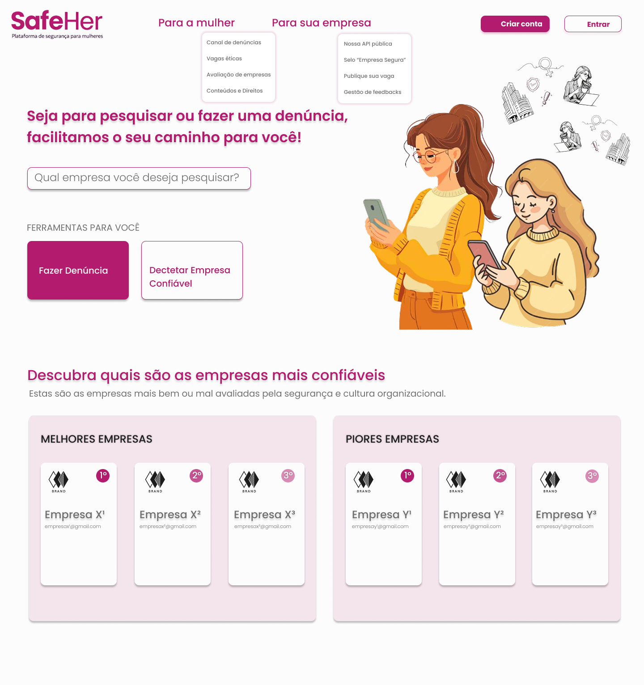
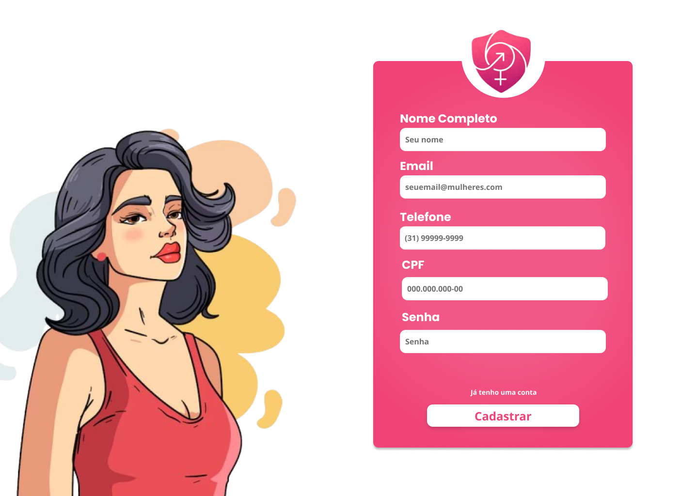
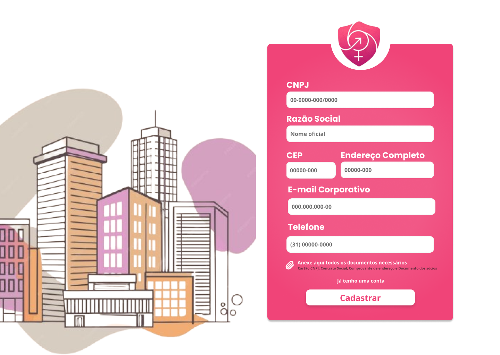

## Artefatos do Projeto

Aqui estão os principais artefatos desenvolvidos ao longo do projeto **SafeHer**, representando a modelagem e prototipação do sistema.

---

### DER (Diagrama Entidade-Relacionamento)
Representação conceitual da estrutura do banco de dados.
- [Acessar DER](./DER/modelo_conceitual.jpeg)

---

### DSC (Diagrama de Esquema)
Visão estrutural dos fluxos e organização do sistema.
- [Acessar DSC](./DSC/diagrama_esquema.jpeg)

---

### Modelo Lógico
Modelagem de implementação do banco de dados.
- [Acessar modelo lógico](./Modelo%20Lógico/modelo_implementacao.jpeg)

---

### Wireframes
Protótipos das principais telas da aplicação.
- Cadastro de Empresa: [Acessar](./Wireframe/cadastro-empresa.png)  
-  Cadastro de Usuária: [Acessar](./Wireframe/cadastro-usuario.png)  
-  Home: [Acessar](./Wireframe/home.png)  
-  Login: [Acessar](./Wireframe/login.png)  
-  Modal: [Acessar](./Wireframe/modal.png)  

---

## Pré-visualização dos Wireframes

### Home

###  Login

### Cadastro de Usuária

### Cadastro de Empresa

### Modal

